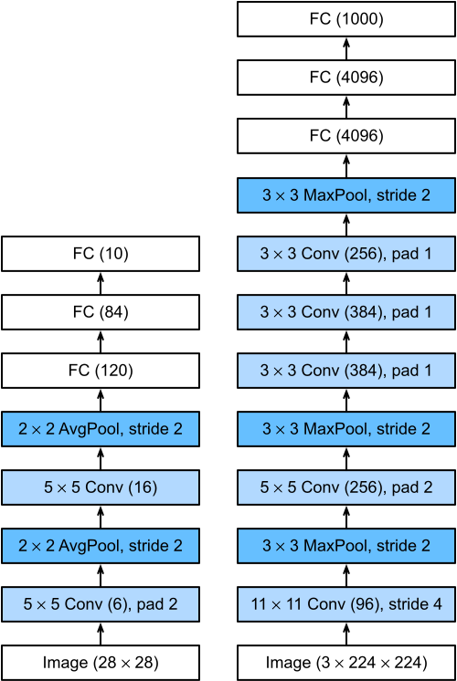

# ShiroNet


ShiroNet is a lightweight, robust, and adversarially hardened vision framework designed for distilled-dataset training and edge inference.

## Project Overview

ShiroNet focuses on practical vision training under resource constraints by combining dataset distillation, adversarial hardening, and deployment-oriented model design. The project is structured for rapid iteration and production readiness.

## Architecture (Distillation Focus)

The architecture separates concerns into:
- Data pipeline and distillation logs (`src/data`, `data/`)
- Model design and edge-friendly backbones (`src/models`)
- Adversarial training hooks (`src/training`)
- Integration layer for Neon Postgres and Supabase (`src/config.py`)

See [docs/architecture/system-overview.md](docs/architecture/system-overview.md) for diagrams and milestone tables.

## Installation

```bash
python -m venv .venv
source .venv/bin/activate  # Windows: .venv\Scripts\activate
pip install --upgrade pip
pip install -r requirements.txt
```

## Quick Start

```bash
python -m src
```

Notebook workflow:
1. Open `notebooks/01_baseline_test.ipynb` for baseline sanity checks.
2. Open `notebooks/02_distillation_trial.ipynb` for distillation + adversarial iteration.
3. Use Kaggle API for dataset pulls and Hugging Face Hub for large checkpoint storage.

CLI workflow:
```bash
python scripts/kaggle_fetch.py --dataset puneet6060/intel-image-classification --out data/raw
python src/data/prepare_dataset.py --input-root data/raw --output-root data/processed/intel_scenes --val-ratio 0.1
python src/train.py --data-root data/processed/intel_scenes --epochs 10 --batch-size 32 --img-size 160 --lr 5e-4 --adv-eps 0.005 --save-dir models/intel_run --pretrained
python scripts/hf_upload.py --repo-name shironet-edge --local-dir models/intel_run --path-in-repo checkpoints/intel-run --private
```

## Tech Stack

- Neon (serverless Postgres)
- Supabase (auth, storage, edge integrations)
- MyTorch (custom training framework bridge)
- PyTorch + TensorRT (training and inference)

## Benchmark Snapshot

Kaggle apples-to-apples benchmark on Intel Scenes (same split and backbone):
- Baseline test accuracy: `82.13%`
- ShiroNet test accuracy: `85.07%`
- Delta: `+2.93` points
- Baseline FGSM (`eps=0.01`): `26.93%`
- ShiroNet FGSM (`eps=0.01`): `73.03%`
- Robustness delta: `+46.10` points

Detailed artifact: `docs/assets/benchmark_kaggle_v1/report.md`

Important comparison note:
- This is a benchmark against our baseline training pipeline on Intel Scenes, not ImageNet-1k leaderboard numbers.
- A direct "better than ImageNet model" claim requires training/evaluation on ImageNet-1k itself.

## Optimization Track

We now support lightweight edge architectures and profiling-first optimization.

Supported training backbones:
- `resnet18`
- `mobilenet_v3_small`
- `shufflenet_v2_x0_5`

Quick profiling command:
```bash
python scripts/profile_model.py --arch shufflenet_v2_x0_5 --num-classes 6 --img-size 160 --batch-size 1 --device cpu --out docs/assets/optimization/profile_shufflenet_v2_x0_5.json
```

Current edge recommendation:
- Use `shufflenet_v2_x0_5` for light + fast deployments
- Continue robust training for adversarial gains

Optimization report:
- `docs/assets/optimization/report.md`

## Architecture Showcase

### Wikipedia Model Visuals

`Residual Block (ResNet family)`  


`AlexNet Block Diagram`  


`Vision Transformer Diagram`  


Source/credit details: `docs/assets/showcase/wikipedia/CREDITS.md`

## License

MIT License. See [LICENSE](LICENSE).
