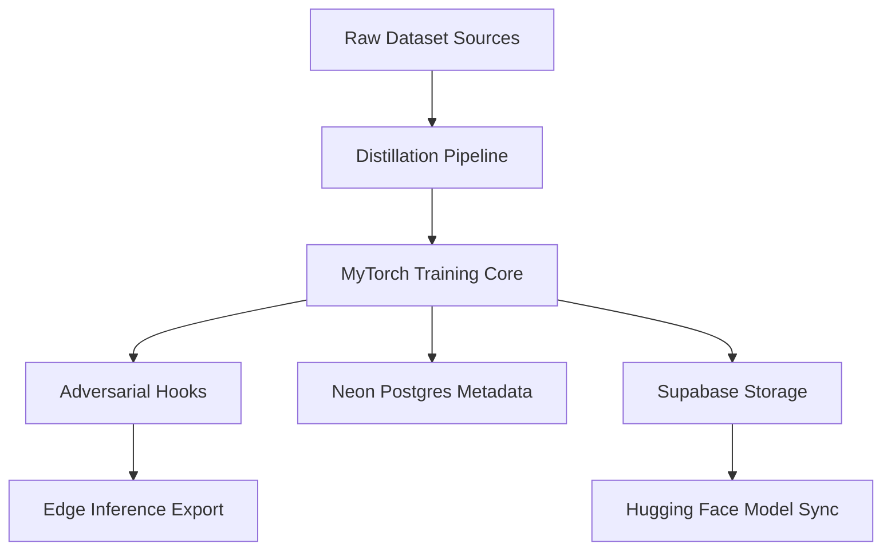

# System Overview

## High-Level Diagram

## Progress Table

| Milestone | Status | Notes |
|---|---|---|
| Repo Bootstrap | Complete | Core structure and config done |
| Baseline Training Notebook | In Progress | `01_baseline_test.ipynb` |
| Distillation Trial | In Progress | `02_distillation_trial.ipynb` |
| HF Checkpoint Sync | Planned | Script + token setup |
| Adversarial Eval Harness | Planned | Add robust test suite |

## Assets

- Dashboard Chart: `docs/assets/training_curve.png`
- Model Animation: `docs/assets/model_evolution.gif`
